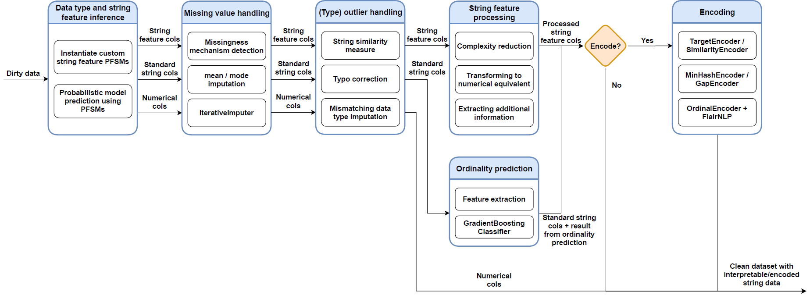
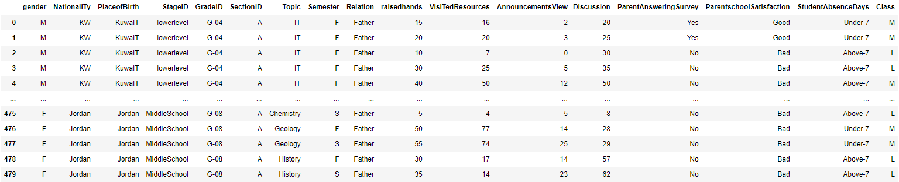
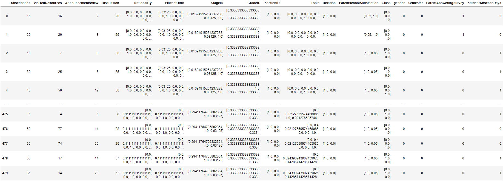
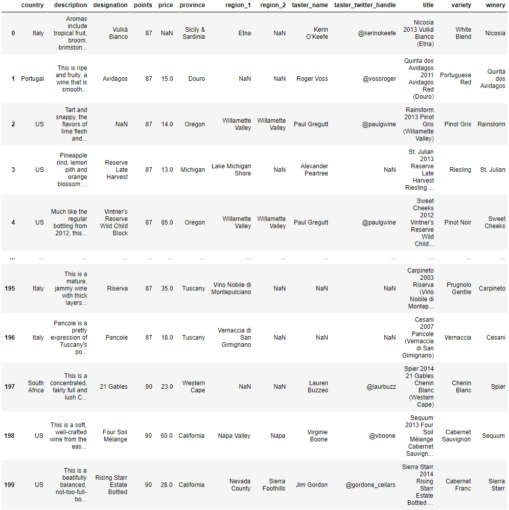
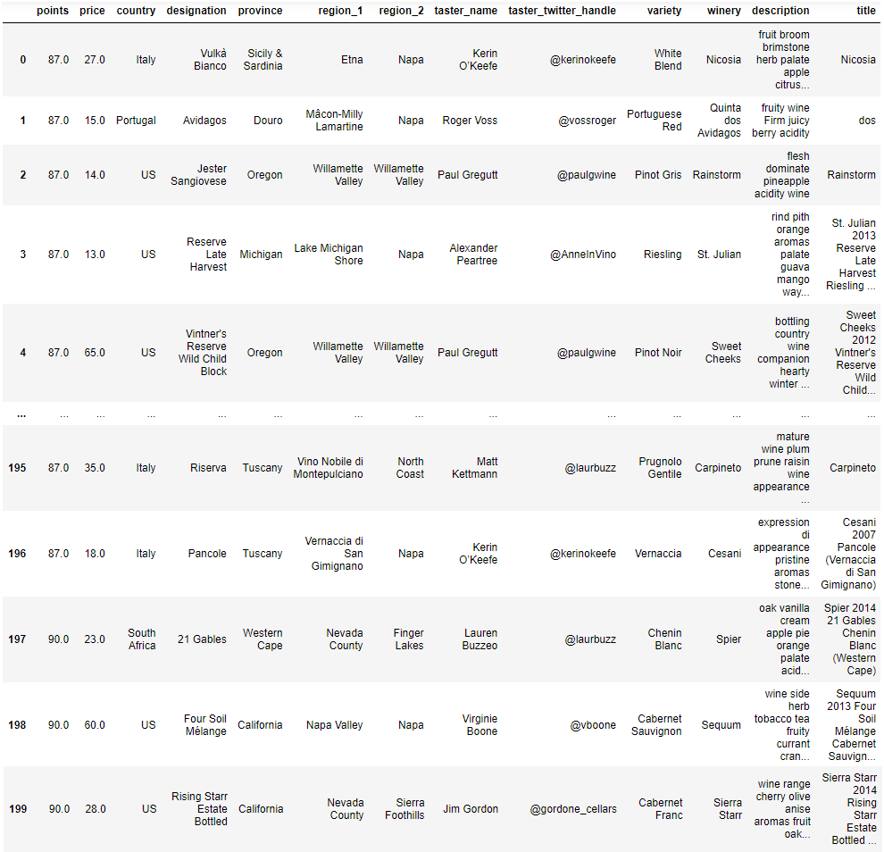

# Automated string cleaning and encoding
## Introduction
auto_string_cleaner is a Python framework aimed at automatically cleaning and encoding string features in tabular data. 
The framework cleans string data in the following steps:

* <b>Data and string feature type inference</b>: Uses ptype by Ceritli et al. (2020) to infer data types in a column,
as well as missing values and outlying data types using Probabilistic Finite-State Machines (PFSMs). 
Additionally, nine string feature PFSMs have been developed to infer specific string features.

* <b>Missing value handling</b>: Imputes missing values accordingly based on their missingness (MCAR, MAR, MNAR). Done for all columns in the dataset.

* <b>(Type) outlier handling</b>: Handles errata in string columns and imputes data type outliers for each column (e.g., a string value in a numerical column).
Done for all columns in the dataset.

* <b>String feature processing</b>: Processes inferred string features with the aim to reduce string complexity, encode properly, or obtain additional features (e.g., geodata).

* <b>Ordinality prediction</b>: Predicts whether regular string columns (i.e., string columns whose string feature could not be inferred in the first step)
contain ordered (ordinal) or unordered (nominal) data using a combination of feature engineering and a classifier that has been trained on features extracted from ordered/unordered data.

* <b>(Optional) Encoding</b>: Encodes all string columns according to ordinality, target class balance (if target column is provided), and cardinality.
Makes use of the dirty_cat library developed by Cerda et al. (2018, 2020).



This framework was developed during my master thesis on automated string handling in tabular data.
The thesis was conducted under supervision of Joaquin Vanschoren at Eindhoven University of Technology.

## Installing the framework
Users can install the framework like so:

```
# pip
pip install git+https://github.com/ml-tue/automated-string-cleaning.git

# GitHub clone
git clone https://github.com/ml-tue/automated-string-cleaning.git
```

When cloning from GitHub, it might be necessary to install relevant packages like so:

```
pip install -r requirements.txt
```

## Usage examples
### Example 1: clean and encode the Academic Performance dataset
1. Download the Students' Academic Performance Dataset from https://www.kaggle.com/aljarah/xAPI-Edu-Data.
2. In a Notebook, open the datasat as a pandas DataFrame:
    ```
   import pandas as pd
   
   X = pd.read_csv(r'<path-to-csv>/<filename>.csv')
   display(X)
    ```
   

3. Run the framework:
    ```
   from auto_string_cleaner import main
   
   X = main.run(X)
    ```
   
4. Display the encoded DataFrame:
    ```
    display(X)
    ```
   
   
---

### Example 2: clean the Wine Reviews dataset
1. Download the Wine Reviews dataset from https://www.kaggle.com/zynicide/wine-reviews.
2. In a Notebook, open the dataset as a pandas DataFrame:
    ```
   import pandas as pd
   
   X = pd.read_csv(r'<path-to-csv>/<filename>.csv')
   
   # Optional: consider a subsample
   X = X.iloc[:200, :]
   
   display(X)
    ```
    
    
3. Run the framework:
    ```
   from auto_string_cleaner import main
   
   X = main.run(X, encode=False)
    ```

4. Display the cleaned DataFrame:
    ```
   display(X)
    ```
    
    
## References
[1] Taha Ceritli, Christopher KI Williams, James Geddes (2020). ptype: probabilistic type inference. Data Mining and Knowledge Discovery. https://github.com/alan-turing-institute/ptype

[2] Patricio Cerda, Gaël Varoquaux, Balázs Kégl (2018). Similarity encoding for learning with dirty categorical variables. Machine Learning journal, Springer. https://dirty-cat.github.io/stable/

[3] Patricio Cerda, Gaël Varoquaux (2020). Encoding high-cardinality string categorical variables. IEEE Transactions on Knowledge & Data Engineering. https://dirty-cat.github.io/stable/